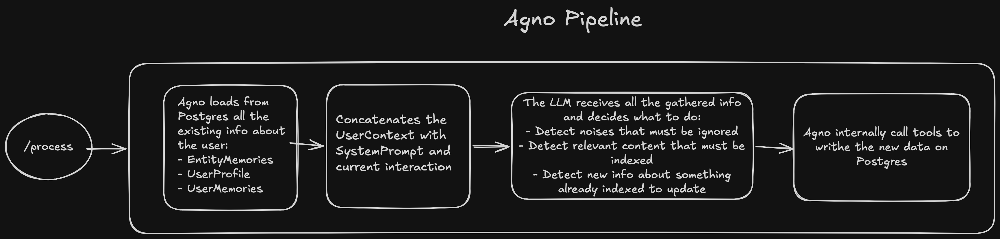
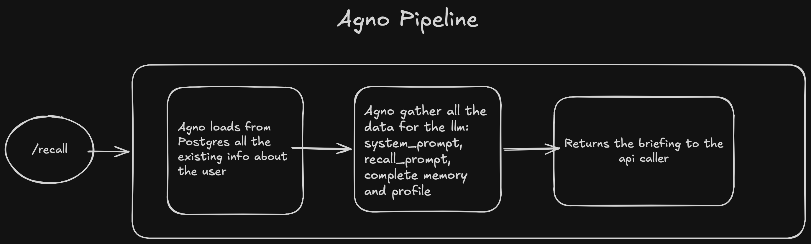

# Agno Memory Bridge API

A **cross-session memory synchronization layer** for [OpenClaw](https://github.com/openclaw/openclaw). Each OpenClaw channel (WhatsApp, Slack, Telegram, Discord, Teams) runs its own isolated session, this API is the shared brain that links them.

Instead of merging conversation contexts (which would explode token costs), the API extracts only **meaningful knowledge** from each interaction and stores it in PostgreSQL via Agno's Learning Machines. When a user starts a session on any channel, the API reads stored memories directly from the database and returns them — no LLM call needed for retrieval, regardless of which channel that information originally came from.

```
User on WhatsApp: "My Acme meeting was moved to Thursday"
                              ↓  POST /process
                    [knowledge extracted + stored]
                              ↓  POST /recall (from Slack)
User on Slack gets: "• Acme meeting: Thursday (via WhatsApp)"
```

| Constraint | How |
|---|---|
| **No unified context** | Each session keeps its own context window → only extracted *knowledge* is shared, not raw history |
| **Near real-time** | Postgres writes on `/process` are synchronous → knowledge is available on the next `/recall` |
| **Conflict resolution** | Latest-write-wins with channel attribution (`source_channel`, `last_updated_channel`) |
| **Selective propagation** | Prompt-driven noise filtering → the LLM decides what crosses channels and what stays local |

---

## Table of Contents

1. [Architecture](#1-architecture)
2. [How It Works — Route by Route](#2-how-it-works--route-by-route)
3. [Agno Learning Machines — Deep Dive](#3-agno-learning-machines--deep-dive)
4. [Cross-Channel Knowledge Flow](#4-cross-channel-knowledge-flow)
5. [Conflict Resolution](#5-conflict-resolution)
6. [Selective Propagation (Noise Filtering)](#6-selective-propagation-noise-filtering)
7. [OpenClaw Integration — The Plugin](#7-openclaw-integration--the-plugin)
8. [Cost Analysis](#8-cost-analysis)
9. [Discussion Answers (Part 2)](#9-discussion-answers-part-2)
10. [Setup & Running](#10-setup--running)
11. [API Reference](#11-api-reference)
12. [Testing](#12-testing)

---

## 1. Architecture

### System overview

```
┌──────────────┐     ┌──────────────┐     ┌──────────────┐
│  WhatsApp    │     │    Slack     │     │   Telegram   │
│   Session    │     │   Session    │     │   Session    │
│  [context A] │     │  [context B] │     │  [context C] │
└──────┬───────┘     └──────┬───────┘     └──────┬───────┘
       │                    │                    │
       │     ┌──────────────────────────┐        │
       └────►│   OpenClaw Plugin        │◄───────┘
             │   (before_prompt_build)  │
             └──────────┬───────────────┘
                        │
              ┌─────────▼─────────┐
              │  Memory Bridge    │
              │  API (FastAPI)    │
              │                   │
              │  POST /process    │─── extract knowledge ──►┐
              │  POST /recall     │─── retrieve briefing ──►│
              │  DELETE /memory/* │─── clear user data  ──►│
              └─────────┬─────────┘                        │
                        │                                   │
              ┌─────────▼─────────┐                        │
              │  Agno Agent       │◄───────────────────────┘
              │  (Claude LLM +    │
              │   LearningMachine)│
              └─────────┬─────────┘
                        │
              ┌─────────▼─────────┐
              │   PostgreSQL      │
              │                   │
              │  user_profiles    │ ← CrossSessionProfile
              │  user_memories    │ ← free-text facts
              │  entity_memories  │ ← Agno default EntityMemory
              └───────────────────┘
```

### Why this approach over alternatives?

| Alternative | Why we didn't use it |
|---|---|
| **Merge all contexts** | Token costs explode linearly. 5 channels × 4K tokens = 20K tokens per call. Violates the "no unified context" constraint |
| **Vector database (Pinecone/Weaviate/any other vector database)** | Agno already handles memory storage in Postgres. Adding a vector DB is redundant and adds ops burden. Agno's LearningMachine does semantic understanding via the LLM. I also really think that we could have issues with the quality of a context retriever built upon RAG architecture, because the core of RAG is to return sentences and data that are top match to the user query, and not to gather relevant info about how a LLM must behave with a user or to fetch data that can  easily change (like user preferences, meetings, coding requirements, etc.) |
| **Shared memory.md with smarter writes** | Still requires loading the full file into every session's context. Doesn't scale with conversation volume |
| **Direct session-to-session messaging** | Tight coupling between sessions. Doesn't work when sessions aren't active simultaneously |

### Why Agno?

1. **LearningMachine is purpose-built** for exactly this: extracting structured knowledge from conversations and recalling it later
2. **`user_id`-keyed storage** — memories are inherently cross-channel (no partitioning by session or channel)
3. **Schema-driven** — we define `CrossSessionProfile` with typed fields for user profiles; the LLM fills them via schema introspection. Entity memory uses Agno's default schema — channel attribution is handled entirely by the system prompt
4. **Curator** — built-in memory curation (pruning, deduplication) without custom code
5. **PostgreSQL backend** — battle-tested, easy to operate, no exotic infrastructure

## 2. How It Works — Route by Route

### `GET /health`

Simple liveness probe. Returns `{"status": "ok"}`.
No database check. A readiness probe (checking DB) could be added separately, but for liveness we just need to know the process is running.

### `POST /process` — Knowledge Extraction

**Purpose:** After every user interaction, OpenClaw sends the conversation to this endpoint. The API extracts meaningful, cross-session knowledge and persists it.

**Internal flow:**

```
1. Pydantic validates request
   - user_id, session_id: non-empty, max 255 chars
   - channel: must be one of {whatsapp, slack, telegram, discord, teams}
   - messages: 1–100 items, each with role + content (max 10K chars)

2. MemoryService.process_messages()
   - Formats conversation as text
   - Builds extraction prompt with source_channel and conflict rules
   - Calls agent.run() via asyncio.to_thread (non-blocking)
     └── Agno sends prompt + instructions to Claude
     └── Claude identifies what's worth saving
     └── Claude emits tool calls: update_entity(), add_memory(), update_user_profile()
     └── Agno executes them and writes to Postgres under user_id

3. Return {"status": "processed"}
```

#### Process route diagram:


**Key design decisions:**
- `session_id` for the extraction call is prefixed: `"extract_{original_session_id}"`. This prevents the extraction prompt from polluting the user's actual conversation session in Agno.
- The LLM decides what to save. There's no code-level filtering — the prompt is the filter. This is intentional: an LLM is better at semantic understanding than regex rules.
- `asyncio.to_thread` wraps the blocking `agent.run()` call so FastAPI can handle concurrent requests.
- `asyncio.wait_for(..., timeout=120)` prevents hung workers.

### `POST /recall` — Context Retrieval

**Purpose:** When the user starts or continues a session on any channel, OpenClaw calls this to get everything the API knows about the user.

**Internal flow:**

```
1. Pydantic validates request

2. MemoryService.recall_context()
   - Accesses agent.learning_machine (lazy property → injects DB on first call)
   - Calls learning_machine.build_context(user_id=...)
     └── Queries Postgres for user_profile, user_memory, entity_memory
     └── Formats results with Agno's built-in template
     └── No LLM call — pure database read + string formatting

3. Parse response:
   - If build_context returns empty → has_memory=false, context=null
   - Otherwise → has_memory=true, context="<user_memory>\n- Acme meeting: Thursday (source: whatsapp)\n..."

4. Return response
```

#### Recall route diagram:


**Key design decisions:**
- **No LLM call on recall.** The previous approach used `agent.run()` to have Claude synthesize a briefing, but this added ~3-5s latency and ~$0.0003 per call. Now recall is a direct DB read (~100-200ms, zero token cost).
- `context` is `Optional[str]`, not `str`. When `has_memory=false`, context is `null`, not an empty string. This makes the two fields semantically consistent.
- The OpenClaw agent receiving the context decides how to use the memories — it doesn't need a pre-summarized briefing.
- This endpoint is **read-only** — it never writes to Postgres.

### `DELETE /memory/{user_id}` — Clear Memory

**Purpose:** GDPR-style data deletion. Removes all stored knowledge for a user.

```
1. MemoryService.clear_memory()
   - Gets LearningMachine from agent
   - Calls curator.prune(user_id=user_id, max_age_days=0)
   - Deletes all profile, memory, and entity data for the user
2. Return {"status": "cleared", "user_id": "..."}
```

---

## 3. Agno Learning Machines — Deep Dive

### What is a LearningMachine?

Agno's `LearningMachine` gives an Agent the ability to **learn from conversations** and **recall learned knowledge**. It's composed of multiple stores:

```
LearningMachine
├── UserProfileConfig    → stores structured profile (name, role, preferences)
│   └── schema: CrossSessionProfile (our custom dataclass)
├── UserMemoryConfig     → stores free-text facts ("prefers dark mode")
└── entity_memory=True   → stores entities with relationships (Agno default schema)
```

### LearningMode options

| Mode | Behavior |
|---|---|
| `ALWAYS` | Extract knowledge on every `agent.run()` call |
| `SMART` | Only extract when the LLM thinks there's something worth saving |
| `NEVER` | Disable learning entirely |

We use `ALWAYS` because we want to capture knowledge from every interaction. The noise filtering is handled by the prompts — the LLM decides what's worth saving, not a mode flag.

### CrossSessionProfile

```python
@dataclass
class CrossSessionProfile(UserProfile):
    preferred_channel: Optional[str]       # whatsapp | slack | ...
    language: Optional[str]                # "portuguese", "english"
    timezone: Optional[str]                # "America/Sao_Paulo"
    role: Optional[str]                    # "Software Engineer"
    company: Optional[str]                 # "XYZ Corp"
    department: Optional[str]             # "engineering"
    communication_style: Optional[str]    # "formal" | "casual"
    topics_of_interest: Optional[List[str]]
```

Each field has `metadata={"description": "..."}` — Agno passes these descriptions to the LLM so it knows what to populate.

### EntityMemory (default)

Entity memory uses Agno's built-in `EntityMemory` schema with `entity_memory=True`, no custom dataclass. Channel attribution (`source_channel`, `last_updated_channel`) is handled entirely through the **system prompt** and **extraction prompt**, where the LLM is instructed to embed channel info directly into entity facts (e.g. `"Acme Corp meeting scheduled for Thursday at 2pm (source: whatsapp)"`).

**Why not a custom schema?** We initially tried `CrossSessionEntityMemory(EntityMemory)` with typed `source_channel` / `last_updated_channel` fields, but Agno's entity memory doesn't propagate `user_id` correctly when using a custom schema — entities were saved with `user_id=NULL`, making them invisible during recall. The default schema works reliably and the LLM embeds channel metadata in the text naturally.

### UserMemory

`UserMemory` is intentionally schema-less. Agno's `UserMemoryConfig` stores **free-text strings**, not structured records — there is no base class to extend. Examples of what gets stored there:

```
"User prefers dark mode"
"User is working on a React migration project"
"User asked to always respond in Portuguese"
```

This is the right store for facts that don't fit a rigid schema. `CrossSessionProfile` holds identity-level structure (role, company, timezone). Entity memory holds named things (meetings, projects, people). `UserMemory` catches everything in between — preferences, context, behavioral notes — as plain text that the LLM can read naturally.

The three stores complement each other:

| Store | Schema | What it holds |
|---|---|---|
| `UserProfileConfig` | `CrossSessionProfile` | Identity: role, company, timezone, preferred channel, communication style |
| `UserMemoryConfig` | *(none — free text)* | Preferences, habits, behavioral notes, anything unstructured |
| `entity_memory=True` | *(Agno default)* | Named things: meetings, projects, deadlines, people — channel attribution via prompt |

### Storage model

All tables in Postgres are keyed by `user_id` alone — there is no `channel` column in the key. This means **cross-channel sharing is automatic**. A fact stored from WhatsApp is immediately visible when querying for the same `user_id` from Slack.

#### How `user_id` is derived at runtime

The OpenClaw plugin injects `curl` commands into the system prompt, and the `user_id` field is set via `$(whoami)` — the OS user running the OpenClaw gateway process. Inside the Docker container this resolves to `node`, so **all channels share the same `user_id` bucket automatically**.

This is the correct behavior for a single-user setup (the challenge's target scenario): one person using the assistant across multiple channels should have one unified memory — and that's exactly what happens. There's no per-channel identity to reconcile.

| Scenario | `user_id` value | Cross-channel? | Notes |
|---|---|---|---|
| **Docker (default)** | `node` | Yes — all channels share the same bucket | Works for single-user, which is the expected setup |
| **Bare metal / local dev** | Your OS username | Yes — same as above | Same behavior, different string |
| **Multi-user (future)** | Would need `senderId` from OpenClaw context | Per-user isolation | Requires adding `senderId?: string` to `PluginHookAgentContext` in OpenClaw core — optional field, non-breaking change |

For production multi-tenant use, the plugin would need the actual sender identity from the channel adapter (e.g. a phone number from WhatsApp, a Slack user ID, etc.). OpenClaw's `PluginHookAgentContext` currently exposes `channelId` but not `senderId`. Adding it would be a one-line, non-breaking change to the core — but it's not needed for the single-user personal assistant scenario this challenge describes.

---

## 4. Cross-Channel Knowledge Flow

### Concrete end-to-end example

**Step 1 — User talks on WhatsApp:**

```
User: "My meeting with Acme Corp got moved to Thursday at 2pm"
Assistant: "Got it! I'll remember the Acme meeting is Thursday at 2pm."
```

OpenClaw plugin calls `POST /process` with `channel: "whatsapp"`. The LLM extracts and stores:
```
EntityMemory: {
  entity_type: "meeting",
  name: "Acme Corp meeting",
  scheduled_date: "Thursday 2pm",
  status: "active",
  source_channel: "whatsapp",
  last_updated_channel: "whatsapp"
}
```

**Step 2 — User opens Slack:**

OpenClaw plugin calls `POST /recall` with `channel: "slack"`. Response:
```json
{
  "user_id": "eduardo",
  "context": "• Meeting with Acme Corp: Thursday 2pm (via WhatsApp)",
  "has_memory": true
}
```

The Slack session now has context it never saw directly — knowledge that originated on WhatsApp was extracted, stored in Postgres, and recalled on demand.

**Step 3 — User updates on Slack:**

```
User: "Actually, Acme meeting is now Friday at 3pm"
```

The LLM: (1) sees the existing entity, (2) recognizes the contradiction, (3) **updates** the entity (no duplicate), (4) sets `last_updated_channel = "slack"`, `scheduled_date = "Friday 3pm"`.

**Step 4 — User goes back to WhatsApp:**

`POST /recall` returns:
```json
{
  "context": "• Meeting with Acme Corp: Friday 3pm (updated via Slack)",
  "has_memory": true
}
```

The WhatsApp session now sees the Slack update. **Full circle.**

---

## 5. Conflict Resolution

### Strategy: Latest-Write-Wins with Channel Attribution

I chose **latest-write-wins (LWW)** because:

1. **It's the most intuitive for users.** When you say "meeting is Thursday" then later say "meeting is Friday", you expect Friday to be the truth.
2. **It's simple to reason about.** No merge conflicts, no manual resolution.
3. **Channel attribution provides auditability.** You can always see which channel last modified a fact.

### How it's implemented (three layers of reinforcement)

**Layer 1 — System prompt:**
```
When new information CONTRADICTS an existing fact:
  1. The most recent statement wins — UPDATE the fact, do not create a duplicate.
  2. Always record which channel the update came from (last_updated_channel).
```

**Layer 2 — Extraction prompt (per-request):**
```
If a fact conflicts with something you already know, UPDATE it (latest wins)
and set last_updated_channel = "{channel}".
```

The system prompt and extraction prompt work together: the system prompt defines the general principle (latest-write-wins), and the extraction prompt reinforces it per-request with the specific channel name. This two-layer approach ensures the LLM consistently applies conflict resolution regardless of which channel the message comes from.

### Why prompt-driven and not code-driven?

| Approach | Pros | Cons |
|---|---|---|
| **Code-level (diff/merge)** | Deterministic, testable | Can't understand semantics. "meeting moved to Thursday" vs "Acme thing is Thursday now" require understanding they're the same meeting |
| **Prompt-driven (LLM decides)** | Semantic understanding, handles natural language ambiguity | Non-deterministic, harder to unit test |

Conflict detection requires semantic understanding — only an LLM can reliably parse it.

### Edge cases

- **Simultaneous updates:** If the user sends on WhatsApp and Slack at the exact same time, the one that arrives at `/process` last wins. Acceptable — the difference is milliseconds, and both carry the user's intent.
- **Semantic ambiguity:** "I like blue" on WhatsApp, then "Green is my favorite" on Slack. The LLM should recognizes both are about favorite color → updates to green. If it doesn't recognize the connection, both get stored (graceful degradation, not failure).

---

## 6. Selective Propagation (Noise Filtering)

### What gets propagated

The system prompt defines explicit SAVE and DO NOT SAVE rules:

**SAVE (propagate across channels):**
- Names, roles, preferences → identity persists everywhere
- Decisions, commitments → "I decided to use React" is relevant on any channel
- Meetings, deadlines → scheduling is universally important
- Entities and relationships → knowing who "Sarah" or "Project X" is helps everywhere
- Communication style → "be formal on Slack" adapts per channel

**DO NOT SAVE (stays local):**
- Greetings, pleasantries → "good morning" on WhatsApp doesn't matter on Slack
- Acknowledgments → "ok", "lol", "👍" are noise
- Unanswered questions → if no one answered, there's no fact to store
- Session-specific references → "scroll up", "as I said" are meaningless cross-session
- Duplicates → already stored facts don't need re-saving

### Why prompt-driven?

Noise vs. signal is a semantic distinction. "That's interesting" after discussing a project might contain useful sentiment. "That's interesting" as a standalone reply is noise. Only an LLM can distinguish these.

### Defense against LLM unreliability

1. **Strong prompt engineering** — the SAVE/IGNORE lists are explicit with examples
2. **Recall prompt acts as a second filter** — even if noise exists in storage, the recall prompt says "only surface facts that have material impact"
3. **Built-in curator** — Agno's curator can `prune` old or low-relevance facts via scheduled job
4. **`DELETE /memory/{user_id}`** — manual safety valve

---

## 7. OpenClaw Integration — The Plugin

The Memory Bridge API is integrated into OpenClaw via a **bundled plugin** (`extensions/learning-machine/`) that lives in the [openclaw fork](https://github.com/viniciusf-dev/openclaw).

The plugin hooks into the `before_prompt_build` lifecycle event — on **every agent turn**, before the model sees any message, it automatically injects mandatory `/recall` and `/process` instructions into the system prompt via `prependSystemContext`. The agent has no choice but to follow them.

This is different from a skill (which the model decides whether to use) — the plugin fires unconditionally on every interaction.

### How it works at runtime

```
User sends message (WhatsApp / Slack / any channel)
        ↓
before_prompt_build hook fires (plugin injects instructions into system prompt)
        ↓
Agent calls curl → POST /recall  (gets prior cross-channel context)
        ↓
Agent uses context to craft a personalized response
        ↓
Agent replies to user
        ↓
Agent calls curl → POST /process  (persists knowledge from this interaction)
```

### Key integration points

1. **`/recall` is called BEFORE the response** — the assistant gets context before it talks, so it can reference cross-channel knowledge naturally
2. **`/process` is called AFTER the interaction** — both user and assistant messages are sent, so the LLM can extract knowledge from the full conversation
3. **Context is prepended to the agent's system prompt** via `prependSystemContext` — prompt-cached, not injected as a fake chat message, keeps token cost efficient
4. **`has_memory: false` is handled gracefully** — if the API returns no memory, the agent continues normally with no impact on the user
5. **API errors fail silently** — if the Memory Bridge is down, the `curl` call fails and the agent continues normally. Memory sync degrades gracefully.
6. **`channelId` is resolved automatically** — the plugin reads `ctx.channelId` from the agent runtime context (set by whichever channel adapter received the message) and passes it to the API. No manual configuration per channel.

### Plugin configuration (`~/.openclaw/openclaw.json`)

```json
"plugins": {
  "entries": {
    "learning-machine": {
      "enabled": true,
      "hooks": { "allowPromptInjection": true },
      "config": {
        "apiUrl": "http://agno-api:8000",
        "defaultChannel": "discord"
      }
    }
  }
}
```

See `openclaw.json.example` in the openclaw repo root for a full reference config.

### How to run the full stack (OpenClaw + Memory Bridge)

The complete setup instructions — including Docker commands, plugin verification, and a 3-step end-to-end demo — are in the plugin's own README:

**[`extensions/learning-machine/README.md`](https://github.com/viniciusf-dev/openclaw/blob/main/extensions/learning-machine/README.md)** (in the OpenClaw fork)

Quick summary:

1. Start the Memory Bridge API: `docker compose up -d` (in this repo)
2. Start the OpenClaw gateway with the learning-machine overlay: `docker compose -f docker-compose.yml -f docker-compose.learning-machine.yml up -d openclaw-gateway` (in the [openclaw fork](https://github.com/viniciusf-dev/openclaw))
3. Verify: `docker exec openclaw-openclaw-gateway-1 openclaw plugins list | grep learning`

---

## 8. Cost Analysis

### Per-interaction token costs

| Operation | Input tokens (approx) | Output tokens (approx) | Cost (Claude Haiku) |
|---|---|---|---|
| `/process` — extraction | ~500 (system) + ~200 (conversation) = ~700 | ~100 (extracted facts) | ~$0.0002 |
| `/recall` — retrieval | 0 (direct DB read) | 0 (no LLM call) | **$0** |
| **Total per interaction** | ~700 | ~100 | **~$0.0002** |

### Comparison with alternatives

| Approach | Cost per interaction | Scaling behavior |
|---|---|---|
| **Memory Bridge (mine)** | ~$0.0002 | Constant — doesn't grow with number of channels |
| **Unified context (naive)** | ~$0.005+ | Linear with channels × history length |
| **Full history replay** | ~$0.05+ | Quadratic with conversation length |

Our approach is **~10× cheaper** than unified context and **~100× cheaper** than full history replay.

### Infrastructure costs

- **PostgreSQL:** ~$0/month (Docker) or ~$15/month (managed)
- **API server:** Single container, minimal resources. ~$5/month
- **LLM API:** At 1,000 interactions/day: ~$15/month

**Total: ~$20–35/month** for moderate usage.

---

## 9. Discussion Answers (Part 2)

### 2.1 — Alternatives to OpenClaw

If not using OpenClaw, I would consider:

**Agno for the entire application**
- Developer Experience: I really think Agno could deliver a high quality product, it's developer experience makes out to be pretty easy to build complex AI products, 
- *Extensibility:* Excellent — agno abstractions are on a great level, and have interesting built-in features like Feature Stores, Workflows (graphs approach to deterministic flows).
- *Multi-channel:* No built-in multi-channel support. Agno doesn't have a native integration for Microsoft Teams, only for WhatsApp, Telegram and Discord.
- *Local vs. cloud:* Cloud-first by default. Local is possible but not the default.
- *Maturity:* Large community but frequent breaking changes, delivering new amazing features.

**Build from scratch (FastAPI + raw LLM calls)**
- *Extensibility:* Maximum control, minimum constraints.
- *Multi-channel:* You build everything.
- *Trade-off:* You're reimplementing what frameworks already provide — memory management, prompt orchestration, session handling. I'm not sure of how many time it took to OpenClaw launch to production, but it could take months to build a platform from scratch with the same features without all the community help and contribution.

**Why I think OpenClaws it's a good choice** — because it's local-first, channel-agnostic (22+ adapters), and the skill/plugin model lets us add memory sync without forking the core. It's the right level of abstraction for this problem.

### 2.2 — Advantages and Disadvantages of OpenClaw

**Strengths:**
- **22+ channel adapters** — the hard part of multi-channel (OAuth, webhooks, message formats) is already solved
- **Local-first** — no cloud vendor lock-in, no data leaving your infrastructure
- **Skill model** — clean separation between core bot logic and extensions
- **"No vector database" philosophy** — reduces infrastructure complexity. For cross-session memory, semantic understanding via LLM calls is more reliable than vector similarity search for this use case

**Weaknesses:**
- **`memory.md` as primary memory** — flat file storage doesn't scale, no concurrent access handling, no structured queries
- **No built-in cross-session sync** — the exact problem we're solving
- **Community size** — smaller than LangChain/Botpress. Fewer examples and community answers
- **Single-user focus** — designed for personal assistants, not multi-tenant SaaS

**Risks:**
- *Licensing:* Open source, but governance is unclear. If the maintainers pivot, we're stuck maintaining a fork.
- *Security:* Running locally is great for privacy, but the bot has access to all configured channels, one compromised skill could exfiltrate data from all channels, and we already saw people finding dangerous vulnerabilities on OpenClaw (https://www.kaspersky.com/blog/openclaw-vulnerabilities-exposed/55263/)
- *"No orchestration framework" philosophy:* Simplifies things now, but if we need agentic workflows, we'd need to add it ourselves.

**How the philosophy helps our solution:**
The "no vector database" stance is aligned with our approach. I'm using Agno's LearningMachine to extract structured knowledge into PostgreSQL, not doing similarity search over embeddings. The LLM understands "Acme meeting is Thursday" semantically; i don't need vector math for that.

### 2.3 — Maintaining a Custom Fork

**My strategy: plugin-based integration, not a fork.**

Our solution is a **standalone API** + an **OpenClaw plugin** (`extensions/learning-machine/`). The plugin hooks into `before_prompt_build` to inject mandatory instructions on every agent turn — the agent can't skip them. I don't touch OpenClaw's core routing or session logic at all. In my opinion, this is the most sustainable architecture possible: if OpenClaw changes internally, our plugin only breaks if the `before_prompt_build` hook contract or `prependSystemContext` field changes — both of which are far more stable than internal APIs.

**If I needed a fork anyway:**

1. **Branching strategy:** `main` tracks upstream. `custom/memory-bridge` has our changes. Rebase weekly.
2. **CI/CD:** GitHub Actions that:
   - Runs upstream tests on our branch after every rebase
   - Runs our integration tests (process → recall → verify cross-channel)
   - Flags merge conflicts for manual review
3. **Architectural isolation:**
   - Adapter pattern: our code talks to OpenClaw through defined interfaces, never touching internal data structures directly
   - Feature flags: our modifications behind `MEMORY_BRIDGE_ENABLED=true` so they can be disabled
4. **Contribute upstream:** If our memory bridge proves useful, upstream PRs are the best maintenance strategy. Less divergence = less rebase pain.
5. **Testing:**
   - Contract tests: verify OpenClaw's plugin hook API hasn't changed shape
   - Integration tests: spin up OpenClaw + our API in Docker Compose, run end-to-end scenarios
   - Version pinning: `openclaw==X.Y.Z` in requirements, not `>=`

---

## 10. Setup & Running

### Requirements

- **Docker** and **Docker Compose** — recommended, handles Postgres automatically
- Or to run locally: **Python 3.12+** and **PostgreSQL 14+**
- An **Anthropic API key** — [get one here](https://console.anthropic.com/)
- *Disclaimer*: this API were developed centered in the dev LLM preferences, so the compatible API key is currently one from Anthropic, but it should not be challengin' to add support to another providers like OpenAi, VertexAi, etc since Agno has built-in tools for multiple providers.

### Quickstart with Docker (recommended)

**1. Clone and configure**

```bash
git clone https://github.com/viniciusf-dev/learning-machine-api
cd learning-machine-api

cp .env.example .env
```

Open `.env` and set your Anthropic API key — everything else has working defaults:

```env
ANTHROPIC_API_KEY=sk-ant-...your-key-here...
```

**2. Start**

```bash
docker-compose up --build
```

This starts:
- **PostgreSQL 16** on port `5432` (tables auto-created by Agno on first run)
- **API** on port `8000` (waits for Postgres to be healthy before starting)

**3. Verify**

```bash
curl http://localhost:8000/health
# {"status":"ok"}
```

Interactive docs: **http://localhost:8000/docs**

### Quickstart without Docker

```bash
python -m venv .venv && source .venv/bin/activate
pip install -r requirements.txt

cp .env.example .env
# set ANTHROPIC_API_KEY, POSTGRES_HOST=localhost, POSTGRES_USER, POSTGRES_PASSWORD, POSTGRES_DB

uvicorn src.main:app --reload --port 8000
```

### Environment Variables

| Variable | Default | Description |
|---|---|---|
| `ANTHROPIC_API_KEY` | **required** | Anthropic API key |
| `LLM_MODEL_ID` | `claude-haiku-4-5-20251001` | Claude model ID |
| `LLM_REQUEST_TIMEOUT` | `30` | Seconds before an LLM call times out |
| `LEARNING_MODE` | `always` | `always` \| `smart` \| `never` |
| `ENABLE_ENTITY_MEMORY` | `true` | Track structured entities (meetings, projects, people) |
| `MAX_MESSAGES_PER_REQUEST` | `100` | Max messages per `/process` call |
| `MAX_MESSAGE_LENGTH` | `10000` | Max characters per message |
| `POSTGRES_HOST` | `postgres` | Postgres hostname (`localhost` for local dev) |
| `POSTGRES_USER` | `agno_user` | Postgres user |
| `POSTGRES_PASSWORD` | `agno_password` | Postgres password |
| `POSTGRES_DB` | `agno_memory` | Postgres database name |
| `POSTGRES_PORT` | `5432` | Postgres port |
| `LOG_LEVEL` | `INFO` | `DEBUG` \| `INFO` \| `WARNING` \| `ERROR` |

### Troubleshooting

**`ANTHROPIC_API_KEY` error on startup**
```bash
grep ANTHROPIC_API_KEY .env   # make sure it's set and not empty
```

**`Service not initialized` on first request**
The lifespan failed — usually a DB connection error. Check logs:
```bash
docker-compose logs api
```

**LLM timeout errors**
Increase `LLM_REQUEST_TIMEOUT` in `.env`. Default is 30s.

**Rebuild after changing `.env`**
```bash
docker-compose down && docker-compose up --build
```

**Reset all stored data**
```bash
docker-compose down -v   # removes the postgres_data volume
docker-compose up --build
```

---

## 11. API Reference

### `GET /health`

```bash
curl http://localhost:8000/health
# {"status":"ok"}
```

---

### `POST /process` — Extract and persist knowledge

Called by the OpenClaw plugin **after** each user interaction.

```bash
curl -X POST http://localhost:8000/process \
  -H "Content-Type: application/json" \
  -d '{
    "user_id": "user_12345",
    "session_id": "whatsapp_sess_001",
    "channel": "whatsapp",
    "messages": [
      {"role": "user",      "content": "My Acme Corp meeting was moved to Thursday at 2pm"},
      {"role": "assistant", "content": "Got it, Acme is now Thursday at 2pm."}
    ]
  }'
```

**Response `200`:**
```json
{"status": "processed"}
```

**Supported channels:** `whatsapp`, `slack`, `telegram`, `discord`, `teams`

---

### `POST /recall` — Retrieve context briefing

Called by the OpenClaw plugin **before** each LLM response. Reads memories directly from the database — no LLM call, near-instant response.

```bash
curl -X POST http://localhost:8000/recall \
  -H "Content-Type: application/json" \
  -d '{
    "user_id": "user_12345",
    "session_id": "slack_sess_042",
    "channel": "slack"
  }'
```

**Response `200` (has memory):**
```json
{
  "user_id": "user_12345",
  "context": "• Acme Corp meeting: Thursday 2pm (via WhatsApp)\n• Prefers formal tone on Slack\n• Senior Engineer at XYZ Corp",
  "has_memory": true
}
```

**Response `200` (no memory yet):**
```json
{
  "user_id": "user_12345",
  "context": null,
  "has_memory": false
}
```

---

### `DELETE /memory/{user_id}` — Clear all user data

```bash
curl -X DELETE http://localhost:8000/memory/user_12345
# {"status": "cleared", "user_id": "user_12345"}
```

---

### Error Responses

All errors follow a consistent shape:

```json
{
  "error": "bad_request",
  "message": "Unsupported channel 'instagram'. Must be one of: discord, slack, teams, telegram, whatsapp"
}
```

| HTTP | `error` | When |
|---|---|---|
| `400` | `bad_request` | Invalid channel, missing fields, message too long |
| `500` | `service_error` | Database failure or internal error |
| `500` | `llm_error` | Claude timeout or API error |
| `503` | `service_unavailable` | Services not yet initialized |

---

## 12. Testing

The project includes a comprehensive **pytest** suite with **164 tests** and **98% code coverage**.

### Running Tests

Tests run **inside the Docker container** (they need access to the app modules).

```bash
# Build / rebuild (needed after adding or changing test files)
docker-compose up --build -d

# Run all tests
docker-compose exec api python -m pytest tests/ -v

# Run with coverage report
docker-compose exec api python -m pytest tests/ \
  --cov=src \
  --cov-report=term-missing \
  --cov-config=.coveragerc

# Run a specific test file
docker-compose exec api python -m pytest tests/test_endpoints.py -v

# Run tests matching a keyword
docker-compose exec api python -m pytest tests/ -k "recall" -v
```

### Coverage

The project enforces a minimum coverage threshold of **85%** (configured in `.coveragerc`).

Current coverage:

```
Name                              Stmts   Miss  Cover
-----------------------------------------------------
src/api/endpoints.py                 43      0   100%
src/api/exception_handlers.py        18      0   100%
src/core/config.py                   22      0   100%
src/core/errors.py                   45      0   100%
src/core/prompts.py                  10      0   100%
src/dependencies.py                  36      0   100%
src/domain/models.py                 55      2    96%
src/domain/schemas.py                16      0   100%
src/services/memory_service.py       59      7    88%
src/validation/schemas.py            35      0   100%
-----------------------------------------------------
TOTAL                               339      9    97%
```

### Key Testing Patterns

| Pattern | Description |
|---|---|
| **Mock Agent** | `conftest.py` provides a `mock_agent` fixture with `FakeLearningMachine` and `FakeCurator` to avoid real LLM calls |
| **TestClient** | Integration tests use FastAPI's `TestClient` with the mock agent injected into `app.state` |
| **async** | `pytest.ini` sets `asyncio_mode = auto` — all `async def test_*` functions run automatically |
| **Markers** | `@pytest.mark.unit` and `@pytest.mark.integration` for selective runs |